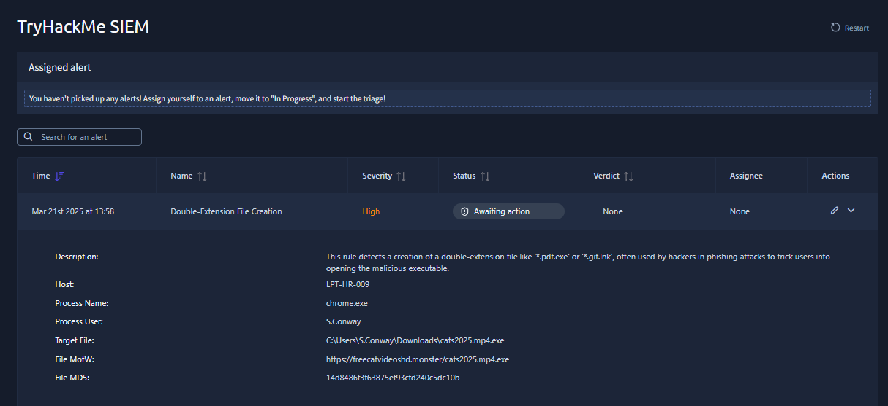
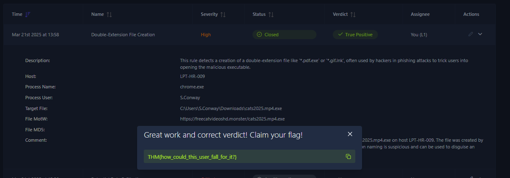

# 🐾 Double-Extension File Creation Investigation


> 📁 SOC Level 1 Alert Triage — Simulated environment (TryHackMe)

---

## 📋 Overview

This project documents the L1 SOC triage of a **High severity** alert triggered by the creation of a suspicious double-extension file on host `LPT-HR-009`, associated with `chrome.exe` and user `S.Conway`.

The investigation focused on analyzing the alert details, identifying suspicious indicators, performing basic threat-intelligence checks, determining the appropriate verdict, and documenting the findings.

---

## 🚨 Alert Details

| Field | Value |
|---|---|
| **Alert Name** | Double-Extension File Creation |
| **Severity** | 🔴 High |
| **Host** | `LPT-HR-009` |
| **Process Name** | `chrome.exe` |
| **Process User** | `S.Conway` |
| **Target File** | `C:\Users\S.Conway\Downloads\cats2025.mp4.exe` |
| **File MotW (Source URL)** | `https://frecativideoshd.monster/cats2025.mp4.exe` |
| **MD5** | `14d8486f638375e93cfd240c5dc10b` |

---

## 🧭 Attack Chain


---

## 🔍 Investigation

### 1️⃣ File Analysis

- The target file `cats2025.mp4.exe` uses a **double-extension** naming technique.
- The filename contains a media-looking extension (`.mp4`) followed by the actual executable extension (`.exe`).
- This naming technique can make an executable appear to be a legitimate media file and may be used to trick users into opening it.
- The file was created in the user's `Downloads` directory and was associated with `chrome.exe`.

**Verdict for this indicator:** 🔴 Suspicious — strong masquerading indicator.

---

### 2️⃣ URL Analysis

- Source URL: `https://frecativideoshd.monster/cats2025.mp4.exe`
- The URL was reviewed using VirusTotal.
- At the time of analysis, the URL received **0/90 detections**.
- The domain `frecativideoshd.monster` received **0/89 detections**.
- No useful public search results were identified for the domain during the investigation.
- The absence of detections does not prove that the URL or domain is benign.
- The available threat-intelligence checks did not independently confirm the domain as malicious.

**Verdict for this indicator:** 🟠 Suspicious based on the overall alert context, but not independently confirmed as malicious by the reputation checks performed.

---

### 3️⃣ Hash Analysis

- MD5: `14d8486f638375e93cfd240c5dc10b`
- The MD5 hash was checked using VirusTotal.
- No useful file detection results were available from the lookup performed.
- Therefore, the hash could not independently confirm the file as malicious.

**Verdict for this indicator:** 🟠 Inconclusive.

---

### 4️⃣ User and Host Analysis

- Host: `LPT-HR-009`
- User: `S.Conway`
- Process: `chrome.exe`
- The file was created in the user's `Downloads` directory.
- The available alert evidence associates the file creation with Chrome and an external URL.
- The current alert evidence does not show that the executable was launched or executed.

This limits the confirmed scope of the activity to the **file creation stage**.

---

## 🗺️ MITRE ATT&CK Mapping

| Tactic | Technique | ID |
|---|---|---|
| Defense Evasion | Masquerading: Double File Extension | `T1036.008` |
| User Execution | Malicious File | `T1204.002` *(Potential — execution not confirmed)* |

---

## 📸 Evidence

The investigation evidence is documented in the `Evidence/` directory.

### Alert Overview

The original SIEM alert showing the alert name, severity, affected host, user, process, target file, source URL, and MD5 hash.



### Final Verdict

The final SIEM state after completing the L1 triage:

- **Status:** Closed
- **Verdict:** True Positive
- **Assignee:** You (L1)



---

## 📝 Investigation Summary

The alert was triggered by the creation of a double-extension executable file on host `LPT-HR-009`.

The file was named `cats2025.mp4.exe`, which uses a media-looking extension (`.mp4`) before the actual executable extension (`.exe`). This naming technique can be used to make an executable appear to be a legitimate media file.

The file was associated with `chrome.exe` under the user `S.Conway` and originated from the following external URL:

`https://frecativideoshd.monster/cats2025.mp4.exe`

The associated MD5 hash was:

`14d8486f638375e93cfd240c5dc10b`

Threat-intelligence checks were performed against the URL, domain, and file hash. The URL received **0/90 detections** and the domain received **0/89 detections** at the time of analysis. These results did not independently confirm the indicators as malicious.

However, the alert correctly identified suspicious double-extension file creation activity. The available evidence confirmed the file creation stage, while execution of the executable was not confirmed.

---

## ✅ Final Verdict

> ## 🟢 **TRUE POSITIVE**

The alert was correctly triggered by the creation of a suspicious double-extension executable file on host `LPT-HR-009`.

The file `cats2025.mp4.exe` uses a media-looking filename followed by the `.exe` executable extension. The file was associated with `chrome.exe`, user `S.Conway`, an external URL, and an MD5 hash.

Threat-intelligence checks performed during the investigation did not independently confirm the URL, domain, or hash as malicious. However, the alert correctly identified the suspicious double-extension file creation activity.

The alert was therefore classified as a **True Positive** and closed after L1 triage.

**Confirmed scope:** File creation.

**Execution:** Not confirmed by the available alert evidence.

---

## 🛠️ Recommended Actions

- [ ] **Confirm** through EDR whether `cats2025.mp4.exe` was executed.
- [ ] **Quarantine/delete** the file if it is still present, according to the organization's incident response procedure.
- [ ] Search the environment for the same MD5 hash.
- [ ] Search for other endpoints that accessed the source domain.
- [ ] Block the domain if confirmed malicious by the security team.
- [ ] Notify the affected user and provide security awareness guidance regarding double-extension files.
- [ ] Escalate to L2/Incident Response if execution or additional malicious activity is identified.

---

## 🎓 Lessons Learned

- Double-extension filenames can be used as a **masquerading technique** to make executable files appear to be legitimate media files.
- A suspicious filename alone does not prove that a file is malicious; additional evidence and threat-intelligence checks should be considered.
- A **True Positive alert** means the detection correctly identified the suspicious activity; it does not necessarily mean that malware execution or endpoint compromise has been confirmed.
- Threat-intelligence results with no detections should be treated as **inconclusive**, rather than proof that an indicator is safe.
- Distinguishing between **file creation** and **file execution** is important when determining the confirmed scope of an incident.
- Clear, structured documentation — indicators, investigation steps, verdict, MITRE mapping, and recommended actions — is essential for SOC analyst handoffs and audit trails.

---

## 🔄 SOC L1 Triage Workflow

The alert was handled following a standard SOC L1 triage workflow:

```text
Alert Received
      ↓
Alert Prioritization
      ↓
Assigned to L1 Analyst
      ↓
Status → In Progress
      ↓
Review Alert Details
      ↓
Identify Suspicious Indicators
      ↓
Threat Intelligence Checks
      ↓
Determine Verdict
      ↓
Add Analyst Comment
      ↓
Status → Closed
```

---

## 🎯 Investigation Outcome

| Investigation Item | Result |
|---|---|
| **Alert Detected** | ✅ Yes |
| **Double Extension Identified** | ✅ Yes |
| **External URL Identified** | ✅ Yes |
| **MD5 Identified** | ✅ Yes |
| **Threat Intelligence Checked** | ✅ Yes |
| **Malicious Reputation Confirmed** | ❌ No |
| **File Execution Confirmed** | ❌ No |
| **Alert Verdict** | 🟢 True Positive |
| **Final Status** | 🟢 Closed |

---

## 🧠 Analyst Takeaway

This investigation demonstrates the importance of distinguishing between an alert being a **True Positive** and proving that a system has been fully compromised.

In this case, the SIEM correctly detected suspicious double-extension file creation. The available evidence supported the alert as a **True Positive**, while execution and further compromise were not confirmed.

The investigation therefore remained within the confirmed scope of the available evidence and documented additional actions that could be performed by EDR, L2, or Incident Response teams.

---

*Investigation conducted as part of a simulated SOC environment (TryHackMe).*
