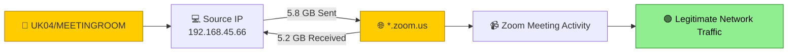
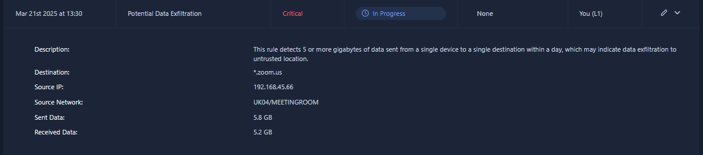
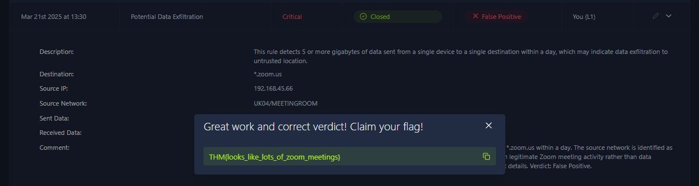

# 📊 Potential Data Exfiltration Investigation


> 📁 SOC Level 1 Alert Triage — Simulated environment (TryHackMe)

---

## 📋 Overview

This project documents the L1 SOC triage of a **Critical severity** alert triggered by a large amount of outbound network traffic from a single source to a single destination.

The investigation focused on determining whether the observed network traffic represented legitimate activity or potential data exfiltration.

The alert was ultimately classified as a **False Positive** based on the available alert context.

---

## 🚨 Alert Details

| Field | Value |
|---|---|
| **Alert Name** | Potential Data Exfiltration |
| **Severity** | 🔴 Critical |
| **Time** | Mar 21st 2025 at 13:30 |
| **Source IP** | `192.168.45.66` |
| **Source Network** | `UK04/MEETINGROOM` |
| **Destination** | `*.zoom.us` |
| **Sent Data** | `5.8 GB` |
| **Received Data** | `5.2 GB` |
| **Final Verdict** | False Positive |
| **Final Status** | Closed |
| **Assignee** | You (L1) |

---

## 🧭 Activity Flow



---

## 🔍 Investigation

### 1️⃣ Alert Trigger Analysis

The alert was triggered because more than **5 GB of data was sent from a single device to a single destination within one day**.

The observed outbound traffic was:

`5.8 GB`

The detection rule considers this volume potentially indicative of data exfiltration to an untrusted destination.

However, the rule itself only identifies an unusual data volume and does not independently confirm malicious data exfiltration.

**Verdict for this indicator:** 🟠 Suspicious — high outbound data volume triggered the detection.

---

### 2️⃣ Destination Analysis

- Destination: `*.zoom.us`
- The destination is associated with Zoom traffic.
- The destination is not presented in the alert as an unknown IP address or an obviously suspicious domain.
- The source network is identified as `UK04/MEETINGROOM`.

The combination of a meeting-room network and traffic to Zoom provides important context when assessing the alert.

**Verdict for this indicator:** 🟢 Consistent with legitimate activity.

---

### 3️⃣ Network Traffic Analysis

The alert recorded:

| Traffic Direction | Amount |
|---|---:|
| **Sent** | `5.8 GB` |
| **Received** | `5.2 GB` |

The traffic was therefore not limited to a large outbound transfer.

A significant amount of data was also received from the same destination.

The available alert information is consistent with high-volume two-way network communication rather than providing direct evidence of unauthorized data transfer.

**Verdict for this indicator:** 🟢 Consistent with legitimate Zoom-related network activity.

---

### 4️⃣ Source Network Analysis

- Source IP: `192.168.45.66`
- Source Network: `UK04/MEETINGROOM`

The source network is explicitly identified as a **MEETINGROOM** network.

This provides important environmental context because high-bandwidth applications such as video conferencing can generate significant network traffic.

The available evidence does not identify a suspicious user, suspicious process, sensitive file transfer, or unauthorized destination.

**Verdict for this indicator:** 🟢 No evidence of malicious activity in the available alert details.

---

## 🧠 Investigation Reasoning

The alert was initially concerning because the outbound traffic exceeded the configured threshold of **5 GB**.

However, the following context reduced the likelihood of data exfiltration:

- Destination was `*.zoom.us`.
- Source network was `UK04/MEETINGROOM`.
- Outbound traffic was `5.8 GB`.
- Inbound traffic was also significant at `5.2 GB`.
- No suspicious destination or malicious activity was identified in the available alert details.
- No evidence of unauthorized data transfer was provided by the alert.

Therefore, the alert was determined to represent legitimate network activity that triggered the data-volume detection rule.

---

## 🗺️ MITRE ATT&CK Mapping

| Tactic | Technique | ID | Relevance |
|---|---|---|---|
| Exfiltration | Exfiltration Over C2 Channel | `T1041` | Considered by the detection logic, but not confirmed in this investigation |

> **Note:** MITRE ATT&CK mapping represents the behavior the detection is designed to identify. In this case, the technique was **not confirmed** because the alert was determined to be a False Positive.

---

## 📸 Evidence

The investigation evidence is documented in the `Evidence/` directory.

### Alert Overview

The original SIEM alert showing:

- Critical severity
- Source IP
- Source network
- Destination
- Sent data
- Received data



### Final Verdict

The final SIEM state after completing the L1 triage:

- **Status:** Closed
- **Verdict:** False Positive
- **Assignee:** You (L1)



---

## 📝 Investigation Summary

The **Potential Data Exfiltration** alert was triggered after the source IP `192.168.45.66` sent **5.8 GB** of data to `*.zoom.us` within a day.

Although the volume exceeded the detection threshold, additional context was considered during the investigation.

The source network was identified as `UK04/MEETINGROOM`, while the destination was associated with Zoom. The connection also involved **5.2 GB of received data**, indicating significant two-way communication.

Based on the available alert information, the activity was consistent with legitimate Zoom meeting traffic rather than unauthorized data exfiltration.

No evidence of malicious data exfiltration was identified within the available alert details.

The alert was therefore classified as a **False Positive** and closed after L1 triage.

---

## ✅ Final Verdict

> ## 🟢 **FALSE POSITIVE**

The alert correctly detected network traffic exceeding the configured data-volume threshold.

However, the available context indicated that the traffic was associated with `*.zoom.us` from the `UK04/MEETINGROOM` network, with significant data transferred in both directions.

No evidence of malicious data exfiltration was identified in the available alert details.

Therefore, the alert was classified as a **False Positive** and closed.

---

## 🛠️ Recommended Actions

- [ ] Review the detection threshold for high-volume traffic to commonly used collaboration platforms.
- [ ] Consider adding trusted business services such as Zoom to appropriate detection exclusions or tuning rules where justified.
- [ ] Continue monitoring high-volume transfers to unknown or untrusted destinations.
- [ ] Investigate the source endpoint further if similar high-volume traffic is observed toward suspicious destinations.
- [ ] Correlate future alerts with network, user, and application context before escalating potential data exfiltration alerts.
- [ ] Document legitimate high-volume business traffic patterns to reduce repetitive false positives.

---

## 🎓 Lessons Learned

- A **Critical severity** alert does not automatically mean that a cyberattack has occurred.
- High data volume alone is not sufficient evidence of data exfiltration.
- **Context is critical** when investigating network-based alerts.
- The destination, source network, traffic direction, and amount of data should all be considered during triage.
- Significant inbound and outbound traffic can be consistent with legitimate applications such as video conferencing.
- A SOC analyst should avoid making a verdict based only on the detection rule or severity.
- Proper alert tuning can help reduce repeated false positives while maintaining visibility into suspicious data transfers.
- Clear documentation of the reasoning behind a False Positive verdict is important for future SOC investigations and detection engineering.

---

## 🔄 SOC L1 Triage Workflow

The alert was handled following a standard SOC L1 triage workflow:

```text
Alert Received
      ↓
Alert Prioritization
      ↓
Assigned to L1 Analyst
      ↓
Status → In Progress
      ↓
Review Alert Details
      ↓
Identify High-Volume Traffic
      ↓
Analyze Destination and Source Network
      ↓
Review Sent vs. Received Data
      ↓
Determine Verdict
      ↓
Add Analyst Comment
      ↓
Status → Closed
```

---

## 🎯 Investigation Outcome

| Investigation Item | Result |
|---|---|
| **Alert Detected** | ✅ Yes |
| **High-Volume Traffic Identified** | ✅ Yes |
| **Source IP Identified** | ✅ Yes |
| **Source Network Identified** | ✅ Yes |
| **Destination Identified** | ✅ Yes |
| **Sent Data** | `5.8 GB` |
| **Received Data** | `5.2 GB` |
| **Potential Exfiltration Confirmed** | ❌ No |
| **Malicious Destination Identified** | ❌ No |
| **Alert Verdict** | 🟠 False Positive |
| **Final Status** | 🟢 Closed |

---

## 🧠 Analyst Takeaway

This investigation demonstrates the importance of applying **context-based analysis** during SOC alert triage.

The detection rule correctly identified an unusually large amount of outbound traffic. However, the available evidence showed that the traffic was associated with `*.zoom.us` and originated from a meeting-room network, with significant traffic also being received.

The investigation therefore determined that the alert represented legitimate network activity rather than confirmed data exfiltration.

This case highlights the importance of distinguishing between **an alert condition being triggered** and **malicious activity being confirmed**.

---

*Investigation conducted as part of a simulated SOC environment (TryHackMe).*
