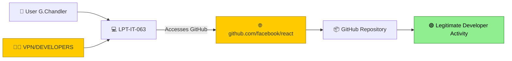
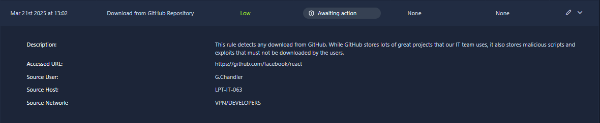
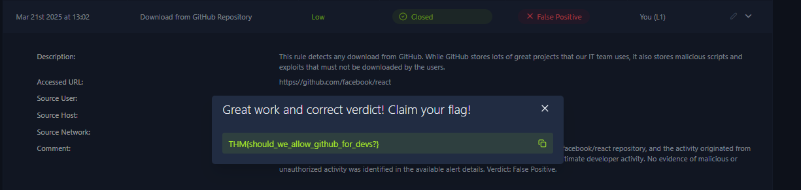

# 🐙 Download from GitHub Repository Investigation


> 📁 SOC Level 1 Alert Triage — Simulated environment (TryHackMe)

---

## 📋 Overview

This project documents the L1 SOC triage of a **Low severity** alert triggered by a download from GitHub.

The investigation focused on determining whether the GitHub activity represented legitimate developer activity or potentially suspicious activity.

The alert was ultimately classified as a **False Positive** based on the available alert context.

---

## 🚨 Alert Details

| Field | Value |
|---|---|
| **Alert Name** | Download from GitHub Repository |
| **Severity** | 🟢 Low |
| **Time** | Mar 21st 2025 at 13:02 |
| **Accessed URL** | `https://github.com/facebook/react` |
| **Source User** | `G.Chandler` |
| **Source Host** | `LPT-IT-063` |
| **Source Network** | `VPN/DEVELOPERS` |
| **Final Verdict** | False Positive |
| **Final Status** | Closed |
| **Assignee** | You (L1) |

---

## 🧭 Activity Flow



---

## 🔍 Investigation

### 1️⃣ Alert Trigger Analysis

The alert was triggered because the user accessed/downloaded content from GitHub.

The detection rule monitors downloads from GitHub because, while GitHub contains many legitimate projects used by IT and development teams, it can also contain scripts and exploits.

The alert therefore identifies the **GitHub download activity itself**, rather than confirming that the downloaded content is malicious.

**Verdict for this indicator:** 🟠 Suspicious activity requiring contextual review.

---

### 2️⃣ Repository Analysis

- Accessed URL:
  `https://github.com/facebook/react`
- The URL points to the `facebook/react` repository on GitHub.
- The activity was associated with the `VPN/DEVELOPERS` network.
- The available alert details provide no indication that the repository or accessed URL was malicious.

The combination of a GitHub software repository and a developer network provides context consistent with legitimate development activity.

**Verdict for this indicator:** 🟢 Consistent with legitimate developer activity.

---

### 3️⃣ User and Host Analysis

- Source User: `G.Chandler`
- Source Host: `LPT-IT-063`
- Source Network: `VPN/DEVELOPERS`

The activity originated from the `VPN/DEVELOPERS` network and involved the `facebook/react` GitHub repository.

This context is consistent with a user performing normal development-related activity.

No suspicious user, host, destination, or additional malicious indicators were identified in the available alert details.

**Verdict for this indicator:** 🟢 No evidence of malicious activity in the available alert details.

---

## 🧠 Investigation Reasoning

The alert was initially generated because GitHub downloads are monitored by the detection rule.

However, contextual analysis showed:

- The accessed URL was the `facebook/react` GitHub repository.
- The source network was identified as `VPN/DEVELOPERS`.
- The activity was associated with user `G.Chandler`.
- No evidence of malicious or unauthorized activity was present in the available alert details.

The activity was therefore assessed as consistent with legitimate developer activity.

---

## 🗺️ MITRE ATT&CK Mapping

| Tactic | Technique | ID | Relevance |
|---|---|---|---|
| Command and Control | Ingress Tool Transfer | `T1105` | Potentially relevant to downloading files from external repositories, but not confirmed as malicious in this investigation |

> **Note:** The MITRE technique above represents behavior that may be associated with downloading tools or files. This investigation did **not** confirm malicious tool transfer.

---

## 📸 Evidence

The investigation evidence is documented in the `Evidence/` directory.

### Alert Overview

The original SIEM alert showing:

- Alert name
- Severity
- Accessed URL
- Source user
- Source host
- Source network



### Final Verdict

The final SIEM state after completing the L1 triage:

- **Status:** Closed
- **Verdict:** False Positive
- **Assignee:** You (L1)



---

## 📝 Investigation Summary

The **Download from GitHub Repository** alert was triggered after user `G.Chandler` accessed the `facebook/react` repository on GitHub from host `LPT-IT-063`.

The activity originated from the `VPN/DEVELOPERS` network.

The detection rule monitors GitHub downloads because repositories can contain both legitimate projects and potentially malicious scripts or exploits.

During the investigation, the accessed repository and source network were reviewed. The activity was consistent with legitimate developer activity, and no evidence of malicious or unauthorized activity was identified in the available alert details.

The alert was therefore classified as a **False Positive** and closed after L1 triage.

---

## ✅ Final Verdict

> ## 🟠 **FALSE POSITIVE**

The alert correctly detected activity involving a GitHub repository.

However, the accessed URL was the `facebook/react` repository, and the activity originated from the `VPN/DEVELOPERS` network under user `G.Chandler`.

The available alert details did not provide evidence of malicious or unauthorized activity.

The activity was therefore assessed as legitimate developer activity.

**Final Verdict:** False Positive

**Final Status:** Closed

---

## 🛠️ Recommended Actions

- [ ] Continue monitoring downloads from external repositories.
- [ ] Correlate GitHub download alerts with the user's role and source network.
- [ ] Review downloaded files if additional suspicious indicators are observed.
- [ ] Investigate repositories containing known malicious scripts or exploits when identified.
- [ ] Consider detection tuning for trusted developer networks where appropriate.
- [ ] Maintain visibility over external code repositories while reducing unnecessary false positives.

---

## 🎓 Lessons Learned

- A GitHub download does not automatically indicate malicious activity.
- **Alert context** is important when determining whether activity is legitimate.
- The user's source network can provide valuable context during L1 triage.
- Developer environments may legitimately interact with public code repositories.
- Detection rules should identify potentially risky behavior without automatically classifying it as malicious.
- A **False Positive** verdict should be supported by clear reasoning and available evidence.
- Understanding the difference between **detection logic** and **malicious activity** is an important SOC analyst skill.
- Proper documentation helps future analysts understand why an alert was closed as a False Positive.

---

## 🔄 SOC L1 Triage Workflow

The alert was handled following a standard SOC L1 triage workflow:

```text
Alert Received
      ↓
Alert Prioritization
      ↓
Assigned to L1 Analyst
      ↓
Status → In Progress
      ↓
Review Alert Details
      ↓
Identify Accessed Repository
      ↓
Analyze User and Source Network
      ↓
Determine Whether Activity Is Legitimate
      ↓
Determine Verdict
      ↓
Add Analyst Comment
      ↓
Status → Closed
```

---

## 🎯 Investigation Outcome

| Investigation Item | Result |
|---|---|
| **Alert Detected** | ✅ Yes |
| **GitHub Activity Identified** | ✅ Yes |
| **Accessed Repository Identified** | ✅ Yes |
| **Source User Identified** | ✅ Yes |
| **Source Host Identified** | ✅ Yes |
| **Source Network Identified** | ✅ Yes |
| **Suspicious Repository Confirmed** | ❌ No |
| **Malicious Activity Confirmed** | ❌ No |
| **Developer Context Identified** | ✅ Yes |
| **Alert Verdict** | 🟠 False Positive |
| **Final Status** | 🟢 Closed |

---

## 🧠 Analyst Takeaway

This investigation demonstrates the importance of using **context when triaging security alerts**.

The detection rule identified GitHub download activity because external repositories can contain both legitimate software and potentially malicious content.

However, the available evidence showed that the activity involved the `facebook/react` repository and originated from the `VPN/DEVELOPERS` network under user `G.Chandler`.

The activity was therefore assessed as legitimate developer activity and the alert was classified as a **False Positive**.

This case highlights the importance of understanding the user's environment, source network, destination, and business context before escalating an alert.

---

## 🏆 Case Result

```text
Alert
  ↓
Download from GitHub Repository
  ↓
Low Severity
  ↓
L1 Triage
  ↓
Context Analysis
  ↓
Developer Network Identified
  ↓
Legitimate Repository Activity
  ↓
False Positive
  ↓
Closed
```

---

*Investigation conducted as part of a simulated SOC environment (TryHackMe).*
